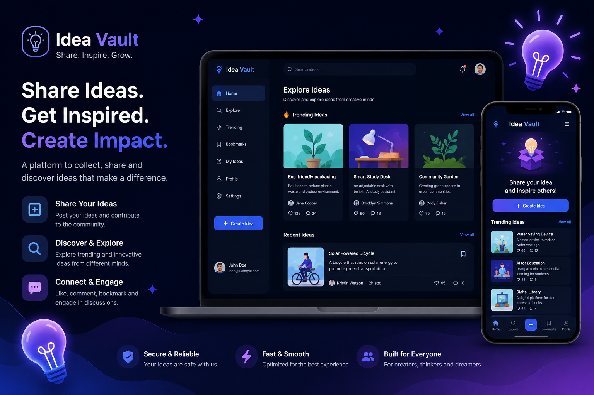

# 💡 Idea Vault – Idea Sharing & Management Platform


## 📌 Project Purpose
Idea Vault is a modern idea-sharing and management platform where users can create, share, and explore innovative ideas. It is designed to encourage collaboration, creativity, and feedback through likes, comments, bookmarking, and trending ideas discovery.

This platform helps users organize their thoughts and discover new ideas in a clean, interactive, and responsive environment.


---
## 📸 Screenshot



---


## 🌐 Live URL
https://idea-vault-client-pi.vercel.app

---

## ✨ Key Features
💡 Create, edit, and delete ideas
🔥 Trending ideas system (based on likes + recent activity)
❤️ Like and interaction system
🔖 Bookmark favorite ideas
💬 Comment system for discussions
🔐 Secure authentication system (login/register) and authorization
👤 User profile management
📊 Dynamic idea feed with filtering and sorting
📱 Fully responsive UI (mobile, tablet, desktop)
⚡ Fast and optimized performance with Next.js

---

## 🛠️ Technologies Used
Next.js (App Router)
React.js
Tailwind CSS
MongoDB / Backend API
NextAuth / Better Auth (Authentication)
Vercel (Deployment)

---

## 📦 NPM Packages Used
- `next`
- `react`
- `react-dom`
- `tailwindcss`
- `mongodb`
- `next-auth` / `better-auth`
- `react-fast-marquee`
- `react-icons`
- `lottie-react`
- `React-Spring`

---

## 🚀 Installation & Setup

```bash
# Clone the repository
git clone https://github.com/kazij317-code/IdeaVault-client

# Go to project folder
cd IdeaVault-client

# Install dependencies
npm install

# Run the project
npm run dev


📌 Future Improvements
🚀 AI-based idea suggestions
📈 Advanced analytics for trending ideas
👥 Team collaboration workspaces
🌍 Public/private idea visibility options
🔍 Advanced search & tagging system
